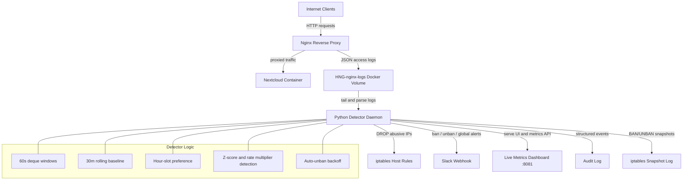

# Architecture Diagram

The placeholder `docs/architecture.png` is invalid and should be replaced with a real exported PNG before final submission.

Use the Mermaid diagram below as the source of truth for the architecture. You can paste it into:

- https://mermaid.live
- draw.io Mermaid import
- Markdown renderers that support Mermaid

Then export the rendered diagram as `docs/architecture.png`.

## Export Instructions

1. Open `docs/architecture.md` or copy the Mermaid block into Mermaid Live.
2. Render the diagram.
3. Export as PNG.
4. Save the exported file as `docs/architecture.png`.

## Required Final State

Before submission:

- `docs/architecture.md` can remain in the repo
- `docs/architecture.png` must be replaced with a real, valid PNG export
